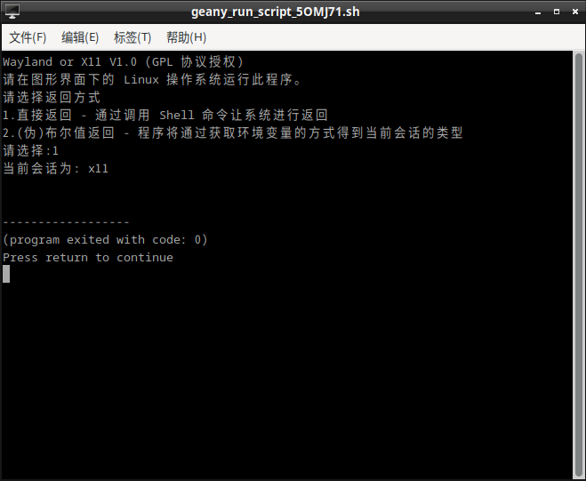

# XOrW
## 截图

## 注意
1. 请在图形界面下的 Linux 操作系统运行此程序 (无法保证能在 Android 设备上运行) 

2. 此程序遵循 GPL 协议，具体请见 LICENSE：

## 用途介绍
Linux 系统的图形界面需要依靠显示服务器来实现，不同的系统环境下可能会选用不同的显示服务器，其中传统的 X11(Xorg) 和 Wayland 最为常见。 

本程序可以简单鉴别当前会话的显示服务器是 X11, Wayland 还是其它小众的显示服务器。
 
## 什么是显示服务器？
### 声明
本人是 Linux 萌新，对 Linux 并不熟悉。因此此部分内容可能存在错误，欢迎各位大佬提点，十分感谢！
### CSDN 上的介绍
显示服务器是一个程序，负责其客户端与操作系统其余部分之间以及硬件和操作系统之间的输入和输出协调。 

基本上，借助显示服务器，您可以以图形方式（GUI）使用计算机。没有显示服务器，您将只能使用命令行界面（TTY）。
 
### 个人理解
UNIX 或 Linux 等类 UNIX 系统其实是没有图形界面的，是纯命令行系统。其图形界面其实是由显示服务器负责呈现的。而用户的对键盘鼠标等输入设备的操作经由它操作反馈到图形界面上，从而完成交互的实现流程。
 
### 主流分类：
 
#### XOrg 或 X11 :
最初是为了取缔商业化的 XFree86， 是其一个分支。 

X11 分为两个部分： X 客户端 (Client) 和 X 服务器 (Server) 

某种程度上这里的 Client 和 Server 与网络上的C/S模型是相反的 

* Server 端负责联系鼠标、键盘、显卡、显示器这些输入输出部件, 通过这些为用户提供服务 

* Client 端负责对数据进行处理
得益于 C/S 结构， XOrg 的 客户端 和 服务器 是可以不在同一部电脑上的。 

因此，在远程桌面、远程控制等场景的性能上，XOrg 更胜一筹

但也因此，X11 的图形性能会较差一些，会出现画面撕裂的现象，对新特性兼容不好

并且 X11 并不内置混成器，这点在 Fedora LXDE 这个 Fedora 分支 (Spin) 上会格外显著

但 X11 有着悠久的历史， 积淀丰富，比起 Wayland 更稳定，有更强的兼容性。（但历史遗留 Bug 同样也很多）

目前绝大部分桌面都支持 X11，有一些甚至还未适配 Wayland 或适配较慢。

 
#### Wayland :
为了取缔落后的 X11 而诞生。 

Wayland 将 X 客户端和 X 服务端以及混成器等组件全部合为一体，它有着独立的协议，支持新的特性 

这也使得 Wayland 性能更好，不会像X11那样画面割裂，浏览器、游戏体验更好（尽管 Linux 没啥游戏） 

但因为没有 C/S 结构， 在远程桌面、远程控制等场景的性能上，XOrg 还是会更胜一筹 

Wayland 的兼容性较 XOrg 差一些（以前差距很大，现在实装了XWayland后好了不少,大部分软件都可以用了 

（腾讯会议：我就不支持 Wayland， 没想到吧）（开个玩笑）

KDE 和 GNOME 两大桌面环境也在积极适配自身桌面各个组件，不断优化其在 Wayland 上的体验，发展前景更好。
 
## 使用流程
1. 选择"直接返回 - 通过调用 Shell 命令让系统进行返回" 或 "(伪)布尔值返回 - 程序将通过获取环境变量的方式得到当前会话的类型"。 （P.S. 填入对应数字即可，填入其它值程序将退出)
2. 程序将输出当前会话类型。

## 不明觉厉？
事实上，此程序原理十分简单(56行代码），就是通过读取或让系统返回 XDG_SESSION_TYPE 这个变量的数值来实现判断，是没啥技术含量的。
